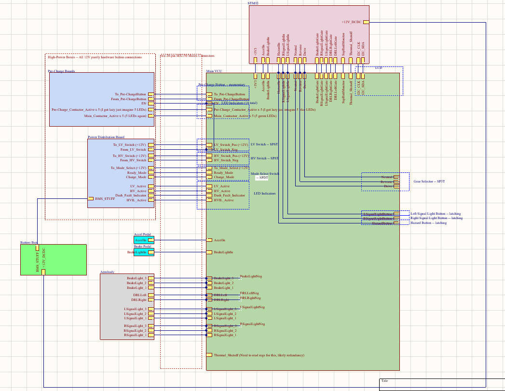

# Sunstang VCU 2026  
Vehicle Control Unit PCB for Western Sunstang

---

## Overview

The **Sunstang VCU 2026** is a custom-designed Vehicle Control Unit PCB developed in **KiCad v6+**.

The board integrates driver inputs, high-voltage enable logic, lighting control, safety interlocks, and vehicle state management into a centralized low-voltage control system.

The system is built around the **STM32 Nucleo-F302R8** development board (ARM Cortex-M4, 3.3V logic).

This PCB acts as the hardware interface between the microcontroller and the vehicle’s 12V automotive systems.

---

## System Architecture

The VCU operates across two voltage domains:

| Domain | Voltage | Description |
|--------|---------|-------------|
| Logic Domain | 3.3V | STM32 microcontroller logic |
| Automotive LV Domain | 12V | Switches, contactors, lighting, HV control |

Signal conditioning ensures safe interfacing between 12V automotive signals and 3.3V MCU GPIO/ADC inputs.

---

### System Integration Diagram

The diagram below shows the high-level integration of:

- STM32 Nucleo-F302R8 (3.3V logic domain)
- 12V automotive domain subsystems
- Pre-charge & contactor control
- Driver interface
- Lighting systems
- BMS interface

  

---

## Microcontroller

**Board:** STM32 Nucleo-F302R8  
**Core:** ARM Cortex-M4  
**Logic Voltage:** 3.3V  

Primary functions:
- ADC acquisition (accelerator and brake pedals)
- Digital input processing (switches and selectors)
- Digital output control (contactors, LEDs, lighting)
- Vehicle state logic (ready mode, charge mode, HV enable)

Documentation:  
https://www.st.com/en/evaluation-tools/nucleo-f302r8.html

---

## Functional Responsibilities

The VCU manages the following subsystems:

### 1. Power & HV Control
- LV switch interface (12V)
- HV switch interface (12V)
- Pre-charge button input
- Pre-charge contactor feedback
- Main contactor feedback
- HV active indication
- BMS interface signals

### 2. Driver Inputs
- Accelerator pedal (ADC input)
- Brake pedal (ADC/digital input)
- Brake light trigger output

### 3. Mode Control
- Ready mode switch
- Charge mode switch
- Mode select (SPDT)
- Gear selector (SPST)

### 4. Lighting Control
- Brake lights
- Daytime running lights (DRL)
- Left turn signal
- Right turn signal
- Hazard (latching)
- Rear signal outputs

### 5. Safety Inputs
- HV active confirmation
- Thermal shutdown input (redundancy planned)
- Pre-charge verification before main contactor closure

---

## Startup Sequence (Simplified)

1. LV switch enabled  
2. HV switch engaged  
3. Pre-charge initiated  
4. Pre-charge confirmed  
5. Main contactor closed  
6. HV active verified  
7. Ready mode enabled  
8. Vehicle operational  

---

## Electrical Characteristics

| Parameter | Value |
|------------|--------|
| Automotive LV Input | 12V DC |
| MCU Logic Voltage | 3.3V |
| Microcontroller | STM32F302R8 |
| Design Tool | KiCad v6+ |
